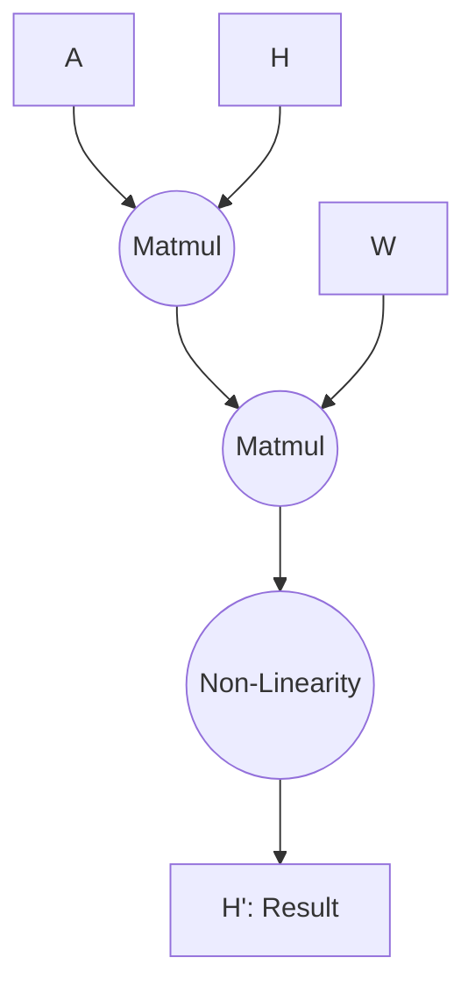
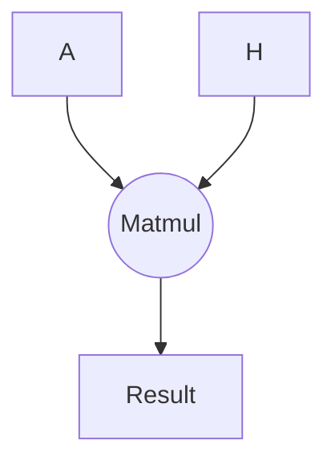

This folder contains microkernels found in GNN models.

Each subfolder will contain a couple of files.

- 00_kernel.mlir : high-level microkernel in MLIR
- 01_annotated.mlir : microkernel : annotated with sparse encodings
- 02_lowered.mlir : sparse encodings are transformed into loop computations
- 03_searched.mlir : marked for outlining with soda-opt
- 04_isolated.mlir : only sparse computation is present
- 05_llvm.mlir : equivalent llvm IR file in MLIR
- 06_kernel.ll : LLVM IR file

The microkernels implement operations found in GNN models, such as:

$\mathbf{H'} = \sigma(\mathbf{AHW})$

i.e., this microkernel would perform the following operations (copy to
[StackEdit](https://stackedit.io/app#) to visualize)

Another microkernel can be:

$\mathbf{Result} = \mathbf{AH}$

